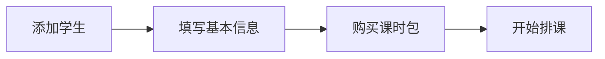
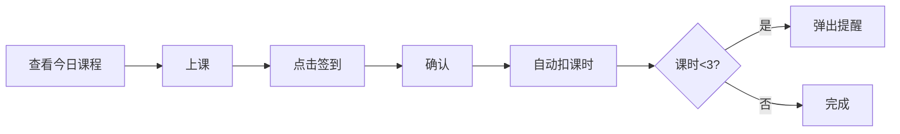
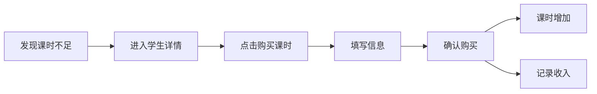

# 声乐教学管理系统 - 产品需求文档

## 文档信息

- **产品名称**：声乐教学管理系统
- **版本**：v1.0.0
- **创建日期**：2025-10-21
- **文档类型**：产品需求文档（PRD）

---

## 一、项目概述

### 1.1 产品定位

声乐教学管理系统是一款专为声乐老师个人使用的轻量级教学管理工具，以微信公众号 H5 应用形式呈现，帮助老师高效管理学生、课程和收益。

### 1.2 目标用户

- **主要用户**：声乐老师（个人使用）
- **学生数量**：8 人
- **使用场景**：日常教学管理、课程安排、收益记录

### 1.3 核心价值

- 📱 随时随地管理课程，无需电脑
- ⚡ 快速点名签到，自动扣除课时
- 💰 实时掌握收益情况
- 📊 清晰的课表视图，避免排课冲突
- 🔔 课时不足自动提醒

---

## 二、功能需求

### 2.1 学生管理模块

#### 功能描述
管理学生的基本信息和课时包购买记录。

#### 详细功能

**学生列表**
- 展示所有学生信息卡片
- 显示：姓名、联系电话、剩余课时
- 剩余课时 < 3 时标红提醒
- 支持按姓名搜索

**添加学生**
- 学生姓名（必填，2-10 个字符）
- 联系电话（必填，11 位手机号）
- 初始课时（选填，默认 0）
- 备注信息（选填，最多 200 字）

**学生详情**
- 基本信息展示和编辑
- 剩余课时显示
- 课时包购买记录
- 上课记录（最近 20 条）
- 删除学生功能（需二次确认）

**购买课时**
- 购买课时数（必填，正整数）
- 支付金额（必填，正数）
- 购买日期（默认今天，可选择）
- 备注说明（选填）
- 提交后自动：
  - 增加学生剩余课时
  - 创建课时包记录
  - 创建收入记录

#### 界面要点
- 卡片式布局，一目了然
- 剩余课时醒目展示
- 快速操作按钮（购买课时、查看详情）

---

### 2.2 排课管理模块

#### 功能描述
创建、修改和管理课程安排。

#### 详细功能

**创建课程**
- 选择学生（必选，单选）
- 上课日期（必选）
- 开始时间（必选）
- 结束时间（必选）
- 上课时长（自动计算，可手动修改，单位：课时）
- 上课地点（选填，如"工作室"）
- 课程备注（选填）

**编辑课程**
- 修改课程任意信息
- 更换学生
- 调整时间

**取消课程**
- 标记为"已取消"
- 不扣除课时
- 保留记录

**快速排课（后期功能）**
- 周期性排课（如每周三 14:00）
- 批量创建课程

#### 业务规则
- 同一时间段不能有重复排课（时间冲突检测）
- 取消的课程不计入统计
- 未签到的课程可以修改

#### 界面要点
- 表单简洁，必填项清晰标注
- 时间选择器友好
- 冲突提醒明显

---

### 2.3 课表视图模块

#### 功能描述
以日历形式可视化展示课程安排。

#### 详细功能

**日历视图**
- 月视图：展示整月排课概况
- 周视图：展示本周详细课表（推荐默认视图）
- 日视图：展示当天所有课程

**课程展示**
- 时间段（如 14:00-15:00）
- 学生姓名
- 状态标识：
  - 🟡 待上课（黄色）
  - 🟢 已完成（绿色）
  - 🔴 已取消（灰色）

**快速操作**
- 点击课程卡片 → 查看详情
- 长按课程 → 快捷菜单（签到/调课/取消）
- 点击空白时间 → 快速创建课程

**筛选功能**
- 查看全部课程
- 仅看待上课
- 仅看已完成

#### 界面要点
- 颜色区分课程状态
- 时间轴清晰
- 滑动流畅

---

### 2.4 点名签到模块

#### 功能描述
记录学生上课情况并自动扣除课时。

#### 详细功能

**签到操作**
- 首页显示"今日待签到"列表
- 点击"签到"按钮
- 确认签到弹窗
- 完成签到后：
  - 课程状态改为"已完成"
  - 自动扣除学生对应课时
  - 若剩余课时 < 3，弹出提醒

**签到状态**
- ✅ 正常签到（扣课时）
- 🚫 请假（不扣课时，标记状态）
- ⚠️ 旷课（扣课时，标记异常）

**补签功能**
- 可对历史课程补签
- 需输入补签原因

**修改签到**
- 可修改已签到的记录
- 课时自动调整

#### 业务规则
- 只能给状态为"待上课"的课程签到
- 签到后课时立即扣除
- 请假不扣课时，但标记状态
- 课时不足时禁止签到，需先充值

#### 界面要点
- 签到按钮醒目
- 一键操作
- 确认弹窗防止误操作

---

### 2.5 收益统计模块

#### 功能描述
记录和统计教学收入，帮助老师掌握财务状况。

#### 详细功能

**收益概览**
- 今日收益
- 本周收益
- 本月收益
- 本年收益
- 总收益

**收入明细**
- 时间倒序列表
- 显示：日期、学生姓名、金额、类型
- 支持按月份筛选
- 支持按学生筛选

**收益趋势图（后期功能）**
- 月度收入柱状图
- 年度收入折线图

**收入来源分析（后期功能）**
- 各学生贡献占比饼图
- 学生消费排行榜

#### 数据来源
- 自动记录：学生购买课时时自动创建收入记录
- 手动添加：其他收入（如教材费、场地费等）

#### 界面要点
- 数据卡片展示清晰
- 金额大号字体
- 颜色区分收支

---

### 2.6 首页仪表盘

#### 功能描述
快速查看今日重点信息和数据概览。

#### 详细功能

**今日课程**
- 显示今天所有课程
- 按时间顺序排列
- 快速签到入口

**数据卡片**
- 今日收益
- 本月已上课程数
- 待签到课程数
- 课时不足学生数

**快捷入口**
- 快速排课
- 添加学生
- 购买课时

#### 界面要点
- 信息密度适中
- 关键数据突出
- 快捷操作方便

---

### 2.7 个人中心

#### 功能描述
个人信息和系统设置。

#### 详细功能

**个人信息**
- 头像（微信头像）
- 昵称
- 联系方式

**教学设置**
- 默认课时长度（如 60 分钟）
- 默认课时单价（如 200 元）
- 默认上课地点（如"音乐工作室"）

**数据管理**
- 数据备份（导出 Excel）
- 数据统计（总课程数、总收益等）

**关于**
- 版本信息
- 使用帮助
- 意见反馈

---

## 三、页面结构

### 3.1 页面导航

**教师账号** - 底部 Tab 栏（5 个）：

| 图标 | 名称 | 说明 |
|------|------|------|
| 🏠 | 首页 | 今日课程 + 数据概览 |
| 📅 | 课表 | 日历视图 |
| 👥 | 学生 | 学生列表管理 |
| 💰 | 收益 | 收益统计 |
| 👤 | 我的 | 个人设置 |

**学生账号** - 底部 Tab 栏（3 个）：

| 图标 | 名称 | 说明 |
|------|------|------|
| 🏠 | 首页 | 我的课时 + 本周课程 |
| 📅 | 课表 | 我的课程安排 |
| 👤 | 我的 | 个人信息和记录 |

### 3.2 页面层级

```
登录页
├── 账号密码登录表单
└── 账号类型选择（教师/学生）

教师端页面结构：
├── 首页
│   ├── 今日课程列表
│   │   └── 课程详情
│   │       ├── 编辑课程
│   │       └── 签到确认
│   ├── 快速排课
│   │   └── 创建课程表单
│   └── 数据概览
├── 课表页
│   ├── 日历视图（日/周/月切换）
│   ├── 课程列表
│   └── 课程详情
├── 学生页
│   ├── 学生列表
│   ├── 添加学生表单
│   └── 学生详情
│       ├── 编辑学生信息
│       ├── 购买课时表单
│       ├── 上课记录列表
│       └── 缴费记录列表
├── 收益页
│   ├── 收益概览
│   ├── 时间筛选
│   └── 收入明细列表
└── 我的页
    ├── 个人信息
    ├── 教学设置
    └── 数据管理

学生端页面结构：
├── 首页
│   ├── 剩余课时显示
│   ├── 本周课程列表
│   └── 课程详情（仅查看）
├── 课表页
│   ├── 我的课程日历
│   └── 课程详情（仅查看）
└── 我的页
    ├── 个人信息
    ├── 我的课时记录
    ├── 我的缴费记录
    └── 切换账号
```

---

## 四、业务流程

### 4.1 新学生入学流程



1. 进入"学生"页面
2. 点击"添加学生"
3. 填写姓名、电话
4. 提交后进入学生详情
5. 点击"购买课时"
6. 填写课时数和金额
7. 确认购买

### 4.2 日常上课流程



### 4.3 课时续费流程



---

## 五、交互设计要点

### 5.1 操作便捷性
- 高频操作不超过 2 步
- 签到一键完成
- 关键信息首页可见

### 5.2 视觉设计

**设计参考**：`docs/style/` 文件夹中的设计稿

**整体风格**：
- 现代清新的界面设计
- 多彩渐变色方案（而非单一蓝色主题）
- 圆角卡片式布局
- 图标化的功能入口

**色彩规范**：
- 学员管理：珊瑚红渐变（#FF8B7B → #FF6B6B）
- 收款/收益：紫色渐变（#A17FFF → #8B5FFF）
- 课表相关：橙黄色渐变（#FFB366 → #FF9A3D）
- 其他功能：采用对应的特色渐变色

**布局规范**：
- 首页功能模块采用网格布局（2列或4列）
- 大圆角卡片（border-radius: 12-16px）
- 统一的图标尺寸和间距
- 清晰的视觉层级

**字体规范**：
- 标题字体：16-18px，加粗
- 正文字体：14px
- 辅助文字：12px
- 字体大小适中，适合快速查看

**图标设计**：
- 扁平化风格
- 与功能语义强关联
- 颜色与模块背景协调
- 直观易懂

### 5.3 反馈机制
- 操作成功 Toast 提示
- 危险操作二次确认
- 加载状态清晰
- 错误信息友好

### 5.4 性能要求
- 页面切换流畅（< 300ms）
- 列表滚动不卡顿
- 图片懒加载
- 数据缓存优化

---

## 六、非功能性需求

### 6.1 兼容性
- 微信内置浏览器
- iOS 和 Android 全面支持
- 屏幕适配：375px - 428px

### 6.2 安全性
- 微信授权登录（仅绑定您的微信）
- 数据加密传输（HTTPS）
- 敏感信息保护

### 6.3 可用性
- 7×24 小时可访问
- 离线数据缓存
- 数据备份机制

### 6.4 性能
- 首屏加载 < 2 秒
- API 响应 < 500ms
- 支持 100+ 条数据流畅展示

---

## 七、开发优先级

### MVP 版本（必须）
✅ **P0 - 核心功能**
1. 学生管理（增删改查）
2. 课时包购买
3. 课程创建
4. 课表展示（周视图）
5. 签到扣课时
6. 基础收益统计

### 第二期（优化）
🔄 **P1 - 重要功能**
1. 月视图和日视图
2. 课时不足提醒
3. 数据导出
4. 周期性排课
5. 收益图表

### 第三期（增强）
⭐ **P2 - 可选功能**
1. **账号密码登录系统**
   - 教师账号登录（最高权限）
   - 学生账号登录（仅查看个人数据）
   - 登录状态持久化
   - 切换账号功能
2. 微信模板消息提醒
3. 教学笔记
4. 学生标签
5. 高级统计分析

---

## 八、验收标准

### 功能验收
- [ ] 能添加 8 个学生并管理信息
- [ ] 能为学生购买课时包
- [ ] 能创建课程并在课表中查看
- [ ] 能对课程进行签到并自动扣课时
- [ ] 能查看收益统计数据
- [ ] 课时不足 3 时能收到提醒

### 性能验收
- [ ] 首页加载时间 < 2 秒
- [ ] 页面切换流畅无卡顿
- [ ] 支持 100+ 条历史记录

### 体验验收
- [ ] 界面美观，符合现代审美
- [ ] 操作简单，无需学习成本
- [ ] 提示信息清晰友好
- [ ] 无明显 Bug

---

## 九、后续规划

### 版本迭代
- **v1.0**：核心功能（3-4 周）
- **v1.1**：优化功能（2 周）
- **v1.2**：高级功能（按需）

### 可扩展方向
- 支持视频课程记录
- 学生学习档案
- 练习作业布置
- 演出/比赛管理
- 更丰富的数据分析

---

## 十一、登录系统需求（第三阶段）

### 11.1 账号类型

系统支持两种账号类型：

#### 教师账号
- **权限**：最高权限，可访问所有功能
- **功能范围**：
  - 学生管理（增删改查）
  - 课程管理（创建、编辑、签到）
  - 收益统计
  - 系统设置
  - 数据导出
- **账号规则**：
  - 账号：系统管理员手机号（手动配置）
  - 密码：手动设置（首次登录后需修改）

#### 学生账号
- **权限**：仅查看个人相关数据
- **功能范围**：
  - 查看个人剩余课时
  - 查看过往上课历史记录
  - 查看每周上课状况（课表）
  - 查看个人缴费记录
- **账号规则**：
  - 账号：手机号（教师添加学生时填写的手机号）
  - 密码：学生姓名首字母（大写）+ 手机号
  - 示例：学生"王小明"，手机号"13800138001"，密码为"W13800138001"

### 11.2 登录流程

1. **访问系统** → 自动检测登录状态
2. **未登录** → 跳转到登录页面
3. **输入账号密码** → 验证身份
4. **登录成功** → 保存登录状态，跳转到对应首页
5. **登录失败** → 显示错误提示

### 11.3 登录状态管理

#### 持久化存储
- **存储位置**：localStorage
- **存储内容**：
  - 用户类型（teacher/student）
  - 用户ID
  - 登录token（JWT）
  - 用户基本信息
- **有效期**：永久有效（除非手动退出或更换设备）

#### 状态检测
- 应用启动时自动检测登录状态
- 每次API请求携带token
- token失效时自动跳转登录页

### 11.4 切换账号

- **入口**：个人中心页面
- **功能**：退出当前账号，返回登录页面
- **数据清理**：清除当前账号的所有本地缓存数据

### 11.5 权限控制

#### 路由守卫
- 未登录用户：只能访问登录页面
- 学生账号：只能访问个人相关页面
- 教师账号：可访问所有页面

#### 页面权限
- **学生账号可见页面**：
  - 个人中心（简化版）
  - 我的课时
  - 我的课程
  - 我的缴费记录
- **教师账号可见页面**：
  - 所有功能页面（无限制）

#### API权限
- 学生账号：只能查询自己的数据
- 教师账号：可以操作所有数据

### 11.6 安全要求

1. **密码加密**：密码使用 bcrypt 加密存储
2. **Token安全**：使用 JWT，设置合理过期时间
3. **防暴力破解**：登录失败5次后锁定账号30分钟
4. **HTTPS**：生产环境必须使用 HTTPS

### 11.7 学生账号自动生成

当教师添加新学生时：
1. 系统自动为学生创建登录账号
2. 账号：学生手机号
3. 密码：姓名首字母（大写）+ 手机号
4. 教师可在学生详情页查看/重置学生密码
5. 首次登录后建议学生修改密码（可选功能）

### 11.8 界面设计

#### 登录页面
- 简洁的登录表单
- 账号类型选择（教师/学生）
- 记住密码选项（可选）
- 忘记密码链接（可选）
- 登录按钮

#### 个人中心（学生版）
- 显示学生基本信息
- 剩余课时显示
- 我的课程入口
- 我的缴费记录入口
- 切换账号按钮

#### 个人中心（教师版）
- 显示教师信息
- 数据统计
- 系统设置
- 切换账号按钮

---

## 十、附录

### 术语表
- **课时**：一节课的时长单位，可自定义（如 60 分钟 = 1 课时）
- **课时包**：学生一次性购买的多个课时
- **签到**：确认学生上课并扣除课时的操作
- **待上课**：已排课但未签到的课程状态

### 参考资料
- 微信公众号开发文档
- Vant 4 组件库文档
- MongoDB 数据库文档

---

**文档版本**：v1.1
**最后更新**：2025-11-12

